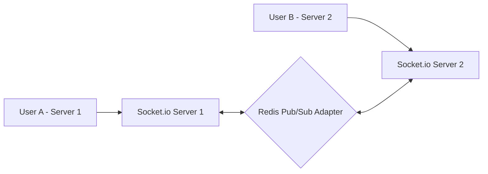

# AI, Payment Gateways, and Real-Time WebSockets Architecture
> **Senior Engineer Note:** When combining slow third-party web services (OpenAI) with real-time operations (WebSockets) and billing transactions (Razorpay), reliability is key. Always validate signatures on payment webhooks, handle rate-limiting errors from LLMs gracefully, and authenticate Socket.io handshakes securely using standard JWT verification.

---

## 1. GPT Integration Architecture (OpenAI SDK v4+)

We utilize OpenAI's **Structured Outputs** (`response_format`) to guarantee that the JSON response matches our database schemas. This eliminates runtime parsing failures caused by raw text outputs.

### 1.1 Resume & ATS Score Analyzer Service (`services/aiService.js`)
This parses the resume text against a job description, calculates the ATS matching score, and identifies weaknesses.

```javascript
const { OpenAI } = require('openai');
const Application = require('../models/Application');

const openai = new OpenAI({
  apiKey: process.env.OPENAI_API_KEY
});

// JSON Schema definition to enforce model structure
const resumeAnalysisSchema = {
  type: "object",
  properties: {
    atsScore: { type: "integer", description: "Score out of 100 based on keyword match and syntax" },
    matchPercent: { type: "integer", description: "Relevance alignment to job specifications out of 100" },
    strengths: { type: "array", items: { type: "string" } },
    weaknesses: { type: "array", items: { type: "string" } },
    interviewTips: { type: "array", items: { type: "string" } }
  },
  required: ["atsScore", "matchPercent", "strengths", "weaknesses", "interviewTips"],
  additionalProperties: false
};

exports.analyzeResumeBackground = async (applicationId, resumeText, jobDescription) => {
  try {
    const response = await openai.chat.completions.create({
      model: "gpt-4o-mini", // Cost-efficient and highly performant for text analysis
      messages: [
        {
          role: "system",
          content: "You are a professional HR recruiter and ATS algorithms expert. Analyze candidate resume text against the job description and output structured analytics."
        },
        {
          role: "user",
          content: `Job Description:\n${jobDescription}\n\nCandidate Resume Text:\n${resumeText}`
        }
      ],
      response_format: {
        type: "json_schema",
        json_schema: {
          name: "resume_analysis",
          schema: resumeAnalysisSchema,
          strict: true
        }
      }
    });

    const parsedData = JSON.parse(response.choices[0].message.content);

    // Save outputs back to MongoDB
    await Application.findByIdAndUpdate(applicationId, {
      atsScore: parsedData.atsScore,
      matchPercent: parsedData.matchPercent,
      aiAnalysis: {
        strengths: parsedData.strengths,
        weaknesses: parsedData.weaknesses,
        interviewTips: parsedData.interviewTips
      }
    });
  } catch (error) {
    console.error("OpenAI analysis failed:", error);
    // Gracefully handle or schedule retry
  }
};
```

---

## 2. Payment Architecture (Razorpay Integration)

SaaS plans:
1. **Free**: 1 resume analysis/month, 0 mock interviews.
2. **Pro**: $15/month - 15 resume analyses/month, 5 mock interviews.
3. **Premium**: $39/month - Unlimited resumes, 20 mock interviews, roadmap generator.

### 2.1 Webhook Endpoint & Signature Checking (`controllers/paymentController.js`)
Always verify the Razorpay webhook signatures using their signature verification utility.

```javascript
const crypto = require('crypto');
const User = require('../models/User');
const Subscription = require('../models/Subscription');

exports.handleRazorpayWebhook = async (req, res) => {
  const webhookSecret = process.env.RAZORPAY_WEBHOOK_SECRET;
  const signature = req.headers['x-razorpay-signature'];

  // Calculate signature locally
  const shasum = crypto.createHmac('sha256', webhookSecret);
  shasum.update(JSON.stringify(req.body));
  const digest = shasum.digest('hex');

  // Verify signature authenticity
  if (digest !== signature) {
    return res.status(400).json({ status: 'fail', message: 'Invalid signature.' });
  }

  // Parse webhook payload
  const event = req.body.event;
  const payload = req.body.payload;

  if (event === 'subscription.charged') {
    const subscriptionId = payload.payment.entity.subscription_id;
    const customerEmail = payload.payment.entity.email;

    // Upgrade customer account status
    const user = await User.findOne({ email: customerEmail });
    if (user) {
      await Subscription.findOneAndUpdate(
        { userId: user._id },
        { status: 'Active', razorpaySubscriptionId: subscriptionId }
      );
    }
  }

  res.status(200).json({ status: 'success' });
};
```

---

## 3. Real-Time WebSocket Architecture (Socket.io)

For chat, typing indicators, and notifications, we design a Socket.io server layer. To scale horizontally to multiple servers, we leverage the Redis adapter for event propagation.



### 3.1 WebSocket Handshake Verification & Initialization (`sockets/socketManager.js`)
Verify tokens during connection setup to ensure unauthorized devices cannot initialize connection channels.

```javascript
const socketIO = require('socket.io');
const jwt = require('jsonwebtoken');
const User = require('../models/User');

const initSocket = (server) => {
  const io = socketIO(server, {
    cors: {
      origin: process.env.CLIENT_URL || "http://localhost:5173",
      methods: ["GET", "POST"],
      credentials: true
    }
  });

  // Authentication Handshake Middleware
  io.use(async (socket, next) => {
    try {
      const token = socket.handshake.auth.token;
      if (!token) {
        return next(new Error("Authentication failed. No token provided."));
      }

      const decoded = jwt.verify(token, process.env.JWT_ACCESS_SECRET);
      const user = await User.findById(decoded.id).select('+role');
      if (!user) {
        return next(new Error("Authentication failed. User not found."));
      }

      socket.user = user;
      next();
    } catch (err) {
      next(new Error("Authentication failed. Invalid Token."));
    }
  });

  // Connection Handler
  io.on('connection', (socket) => {
    console.log(`Socket Connected: User ${socket.user._id} (${socket.user.role})`);

    // Dynamic Room joining
    socket.on('join_room', ({ roomId }) => {
      socket.join(roomId);
      console.log(`User ${socket.user._id} joined room ${roomId}`);
    });

    // Chat Message Event
    socket.on('send_message', ({ roomId, messageText }) => {
      // Emit to the specified room and exclude the sender
      socket.to(roomId).emit('receive_message', {
        senderId: socket.user._id,
        messageText,
        createdAt: new Date()
      });
    });

    // Typing Status indicators
    socket.on('typing', ({ roomId, isTyping }) => {
      socket.to(roomId).emit('typing_status', {
        userId: socket.user._id,
        isTyping
      });
    });

    // Disconnect Action
    socket.on('disconnect', () => {
      console.log(`Socket Disconnected: User ${socket.user._id}`);
    });
  });

  return io;
};

module.exports = initSocket;
```
