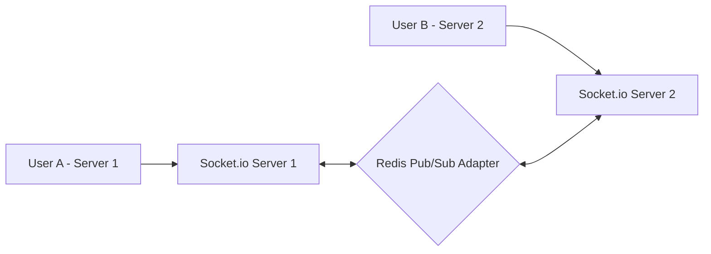

# AI and Real-Time WebSockets Architecture
> **Senior Engineer Note:** When combining slow third-party web services (NVIDIA NIM) with real-time operations (WebSockets), reliability is key. Handle rate-limiting errors from LLMs gracefully, and authenticate Socket.io handshakes securely using standard JWT verification.

---

## 1. NVIDIA NIM Integration Architecture

We utilize NVIDIA NIM's OpenAI-compatible API to guarantee that the JSON response matches our database schemas. This eliminates runtime parsing failures caused by raw text outputs.

### 1.1 Resume & ATS Score Analyzer Service (`services/aiService.js`)
This parses the resume text against a job description, calculates the ATS matching score, and identifies weaknesses.

```javascript
const Application = require('../models/Application');

const NVIDIA_BASE_URL = 'https://integrate.api.nvidia.com/v1';
const MODEL = 'meta/llama-3.3-70b-instruct';

async function callNvidia(messages) {
  const response = await fetch(`${NVIDIA_BASE_URL}/chat/completions`, {
    method: 'POST',
    headers: {
      'Content-Type': 'application/json',
      'Authorization': `Bearer ${process.env.NVIDIA_API_KEY}`
    },
    body: JSON.stringify({
      model: MODEL,
      messages,
      temperature: 0.2,
      max_tokens: 1024,
      stream: false,
      response_format: { type: 'json_object' }
    })
  });
  const data = await response.json();
  return JSON.parse(data.choices[0].message.content);
}

exports.analyzeResumeBackground = async (applicationId, resumeText, jobDescription) => {
  try {
    const parsedData = await callNvidia([
      { role: 'system', content: 'You are a professional HR recruiter and ATS algorithms expert. Analyze candidate resume text against the job description and output structured analytics. Output purely valid JSON: { "atsScore": integer, "matchPercent": integer, "strengths": [string], "weaknesses": [string], "interviewTips": [string] }' },
      { role: 'user', content: `Job Description:\n${jobDescription}\n\nCandidate Resume Text:\n${resumeText}` }
    ]);

    // Save outputs back to MongoDB
    await Application.findByIdAndUpdate(applicationId, {
      atsScore: parsedData.atsScore,
      matchPercent: parsedData.matchPercent,
      aiAnalysis: {
        strengths: parsedData.strengths,
        weaknesses: parsedData.weaknesses,
        interviewTips: parsedData.interviewTips
      }
    });
  } catch (error) {
    console.error("NVIDIA NIM analysis failed:", error);
    // Gracefully handle or schedule retry
  }
};
```


## 2. Real-Time WebSocket Architecture (Socket.io)

For chat, typing indicators, and notifications, we design a Socket.io server layer. To scale horizontally to multiple servers, we leverage the Redis adapter for event propagation.



### 2.1 WebSocket Handshake Verification & Initialization (`sockets/socketManager.js`)
Verify tokens during connection setup to ensure unauthorized devices cannot initialize connection channels.

```javascript
const socketIO = require('socket.io');
const jwt = require('jsonwebtoken');
const User = require('../models/User');

const initSocket = (server) => {
  const io = socketIO(server, {
    cors: {
      origin: process.env.FRONTEND_URL || "http://localhost:5173",
      methods: ["GET", "POST"],
      credentials: true
    }
  });

  // Authentication Handshake Middleware
  io.use(async (socket, next) => {
    try {
      const token = socket.handshake.auth.token;
      if (!token) {
        return next(new Error("Authentication failed. No token provided."));
      }

      const decoded = jwt.verify(token, process.env.JWT_ACCESS_SECRET);
      const user = await User.findById(decoded.id).select('+role');
      if (!user) {
        return next(new Error("Authentication failed. User not found."));
      }

      socket.user = user;
      next();
    } catch (err) {
      next(new Error("Authentication failed. Invalid Token."));
    }
  });

  // Connection Handler
  io.on('connection', (socket) => {
    console.log(`Socket Connected: User ${socket.user._id} (${socket.user.role})`);

    // Dynamic Room joining
    socket.on('join_room', ({ roomId }) => {
      socket.join(roomId);
      console.log(`User ${socket.user._id} joined room ${roomId}`);
    });

    // Chat Message Event
    socket.on('send_message', ({ roomId, messageText }) => {
      // Emit to the specified room and exclude the sender
      socket.to(roomId).emit('receive_message', {
        senderId: socket.user._id,
        messageText,
        createdAt: new Date()
      });
    });

    // Typing Status indicators
    socket.on('typing', ({ roomId, isTyping }) => {
      socket.to(roomId).emit('typing_status', {
        userId: socket.user._id,
        isTyping
      });
    });

    // Disconnect Action
    socket.on('disconnect', () => {
      console.log(`Socket Disconnected: User ${socket.user._id}`);
    });
  });

  return io;
};

module.exports = initSocket;
```
