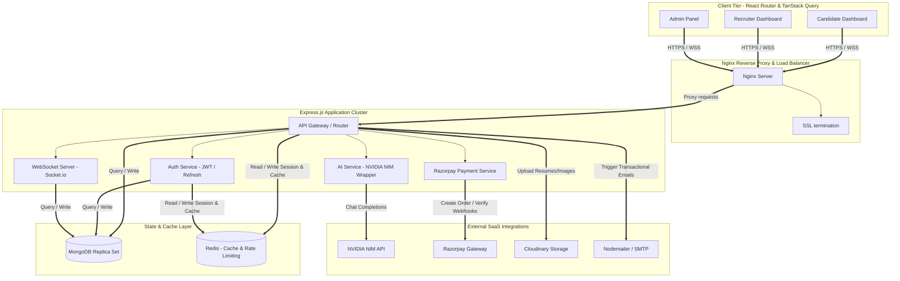
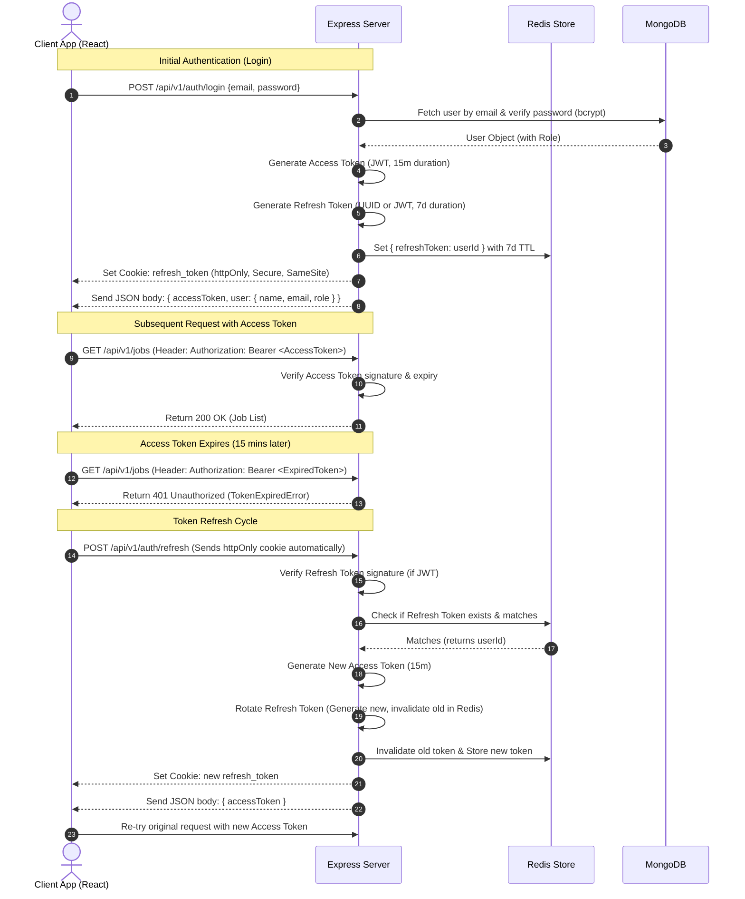

# AI-Powered Interview & Hiring Platform - Systems & Architecture Design
> **Senior Engineer Note:** When building a multi-tenant SaaS application with real-time elements (WebSockets) and heavy computational loads (LLM/AI APIs), separation of concerns, defensive security, and scalable caching are not options—they are foundational. This document outlines our core architecture, design decisions, and data/control flows.

---

## 1. System Architecture Diagram
We employ a decoupled **Three-Tier Architecture** (Client, Gateway/API Application Server, Database/Cache) extended with an asynchronous worker/queue system for AI tasks and email sending to avoid blocking the main event loop.



---

## 2. Authentication & Authorization Flows

### 2.1 Access Token vs. Refresh Token Flow
To minimize database hits while maintaining tight security, we use short-lived JWT Access Tokens (15-minute expiry, stored in client-side memory) and long-lived Refresh Tokens (7-day expiry, stored in a secure, `httpOnly`, `sameSite: strict`, `secure` cookie).



### 2.2 Role-Based Access Control (RBAC) Flow
We enforce API-level route protection using declarative authorization middleware. Permissions are mapped to roles: `Candidate`, `Recruiter`, and `Admin`.

```
User Route Authorization Hierarchy:
[Client Request] ──> [JWT verification] ──> [Require Role: Admin/Recruiter/Candidate] ──> [Resource Ownership Check] ──> [Controller Action]
```

---

## 3. Middleware Design & Chain of Responsibility
The Express pipeline uses a clean modular structure. We separate global middleware (which runs on all routes) from route-specific middleware.

### 3.1 Route Middleware Execution Order
```
Client Request
   │
   ├── [Global] Security headers (Helmet)
   ├── [Global] Cross-Origin Resource Sharing (CORS)
   ├── [Global] Body parser (Express JSON + urlencoded)
   ├── [Global] Logging (Morgan + Winston)
   ├── [Global] Global rate limiter (Redis/Memory)
   │
   ├── [Route-specific] Route Rate Limiter (e.g. strict rate limit on /auth/login)
   ├── [Route-specific] Multer file upload (if uploading resume/avatar)
   ├── [Route-specific] Zod/Joi Payload Validator (runs before controller logic)
   ├── [Route-specific] JWT Authenticator (`protect` route middleware)
   ├── [Route-specific] RBAC Authorizer (`restrictTo('recruiter', 'admin')`)
   ├── [Route-specific] Resource Ownership Auditor (e.g. can only edit their own profile)
   │
   ├── [Controller] Business logic execution
   │
   └── [Global Error Handler] Catches sync & async errors, formats response
```

---

## 4. Logging & Error Handling Strategy

### 4.1 Production Logging Architecture (Winston + Morgan)
* **Winston** is used as the system-wide logger. It formats logs as JSON for structured consumption (e.g., in Datadog, ELK, or AWS CloudWatch) and outputs to console in dev with readable colorized text.
* **Morgan** intercepts incoming requests and pipes HTTP metadata directly into Winston logs.

### 4.2 Centralized Error Handling Framework
We avoid scattered `try/catch` blocks in controllers using an async handler utility wrapper. All runtime errors are caught and transformed into a standardized API response.

```
                  ┌──────────────────────────────┐
                  │ Runtime Error / Rejection    │
                  └──────────────┬───────────────┘
                                 │
                 ┌───────────────▼───────────────┐
                 │    Global Error Middleware    │
                 └───────────────┬───────────────┘
                                 │
                   Is Operational Error (AppError)?
                    /                         \
            [Yes]  /                           \  [No (Programming Bug)]
                  /                             \
    ┌────────────▼─────────────┐          ┌──────▼─────────────────────┐
    │ Send clean API response: │          │ 1. Log full stack trace     │
    │  - Status Code (4xx)     │          │ 2. Alert devs (e.g Sentry) │
    │  - Standardized JSON     │          │ 3. Send generic 500 Msg    │
    └──────────────────────────┘          └────────────────────────────┘
```

---

## 5. Security Best Practices, Rate Limiting, & Caching

### 5.1 Security Checklist
1. **Security Headers**: Using `helmet()` to set headers like CSP, Frame-Options, HSTS, and X-Content-Type.
2. **Data Sanitization**: Cleaning inputs to prevent NoSQL query injection (e.g., using `express-mongo-sanitize`) and XSS attacks (using `xss-clean`).
3. **Password Security**: Hashing with `bcryptjs` using a salt work factor of `12`.
4. **CORS Restrictions**: Whitelisting only our staging and production domains.
5. **No Parameter Pollution**: Utilizing `hpp()` to prevent HTTP Parameter Pollution.

### 5.2 Rate Limiting Layout
We partition rate limits into three categories to optimize UX and safety:
* **Global Rate Limit**: `100 requests per 15 minutes` for standard endpoints.
* **Auth Rate Limit**: Strict `5 requests per 15 minutes` for login, signup, and password resets.
* **AI API Rate Limit**: `15 requests per hour` to manage NVIDIA NIM costs and prevent abuse.

### 5.3 Redis Caching Strategy
We cache computational or DB-heavy read results in Redis:
* **Job Searches**: Cached for 5 minutes with invalidation on new job insertion.
* **Recruiter Analytics Dashboards**: Cached for 15 minutes.
* **Admin Revenue Reports**: Cached for 1 hour.
