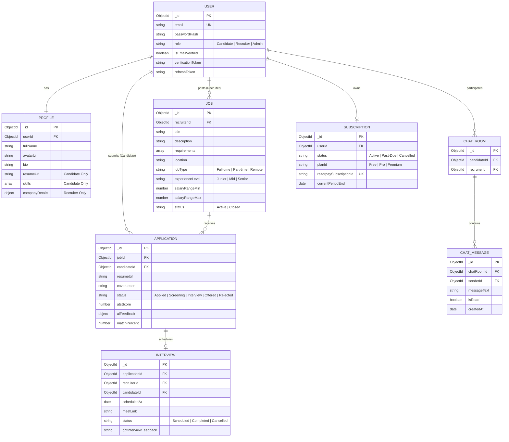

# AI-Powered Interview & Hiring Platform - Database Design & Optimization
> **Senior Engineer Note:** MongoDB is highly performant under read/write loads if structured correctly. When building SaaS platforms, avoid infinite document growth (e.g. embedding infinite messages inside a room document). Instead, design schemas around query frequencies and size boundaries, use compound indexes efficiently, and write analytical aggregation pipelines that run against indexes rather than scanning the entire collection.

---

## 1. Entity Relationship (ER) Diagram
The following entity relationships are designed to enforce data consistency. MongoDB uses referencing (`ObjectId`) for high-volume relational records (like applications and chat messages) and embedding for co-queried, bounded data (like job requirements or ATS breakdown details).



---

## 2. Mongoose Schemas & Schema Optimization

### 2.1 User Schema (`models/User.js`)
* **Optimization**: Store the refresh token as a hashed string or validation ID, indexing it for quick auth validations. Keep authentication checks lean.

```javascript
const mongoose = require('mongoose');

const UserSchema = new mongoose.Schema({
  email: {
    type: String,
    required: [true, 'Email is required'],
    unique: true,
    lowercase: true,
    trim: true,
    index: true // Single-field index for ultra-fast query on login
  },
  password: {
    type: String,
    required: [true, 'Password is required'],
    select: false // Excluded by default for safety
  },
  role: {
    type: String,
    enum: ['candidate', 'recruiter', 'admin'],
    default: 'candidate',
    required: true
  },
  isEmailVerified: {
    type: Boolean,
    default: false
  },
  verificationToken: String,
  passwordResetToken: String,
  passwordResetExpires: Date
}, {
  timestamps: true
});

module.exports = mongoose.model('User', UserSchema);
```

### 2.2 Profile Schema (`models/Profile.js`)
* **Optimization**: Embed structural details depending on roles, allowing dynamic profiles without bloating.

```javascript
const mongoose = require('mongoose');

const ProfileSchema = new mongoose.Schema({
  userId: {
    type: mongoose.Schema.Types.ObjectId,
    ref: 'User',
    required: true,
    unique: true,
    index: true // Fast joins/lookups
  },
  fullName: { type: String, required: true, trim: true },
  avatarUrl: { type: String, default: '' },
  bio: { type: String, default: '' },
  
  // Candidate-specific attributes
  resumeUrl: { type: String, default: '' },
  skills: [{ type: String, index: true }], // Multikey index to search candidates by skill
  experienceYears: { type: Number, default: 0 },
  careerRoadmap: { type: mongoose.Schema.Types.Mixed }, // JSON dump from GPT
  
  // Recruiter-specific attributes
  company: {
    name: { type: String, default: '' },
    website: { type: String, default: '' },
    logoUrl: { type: String, default: '' },
    isVerified: { type: Boolean, default: false }
  }
}, {
  timestamps: true
});

module.exports = mongoose.model('Profile', ProfileSchema);
```

### 2.3 Job Schema (`models/Job.js`)
* **Optimization**: Create compound indexes on location, jobType, and experienceLevel to optimize advanced filtered searches. Create a Text Index on title and description for fast full-text searching.

```javascript
const JobSchema = new mongoose.Schema({
  recruiterId: { type: mongoose.Schema.Types.ObjectId, ref: 'User', required: true, index: true },
  title: { type: String, required: true, trim: true },
  description: { type: String, required: true },
  requirements: [{ type: String }],
  location: { type: String, required: true, index: true },
  jobType: { type: String, enum: ['Full-time', 'Part-time', 'Contract', 'Remote'], required: true },
  experienceLevel: { type: String, enum: ['Junior', 'Mid', 'Senior'], required: true },
  salaryRange: {
    min: { type: Number },
    max: { type: Number }
  },
  status: { type: String, enum: ['Active', 'Closed'], default: 'Active', index: true }
}, {
  timestamps: true
});

// Indexes for high performance
JobSchema.index({ status: 1, createdAt: -1 }); // Compound index for default jobs feed sorting
JobSchema.index({ title: 'text', description: 'text' }); // Text index for full-text search
```

### 2.4 Application Schema (`models/Application.js`)
* **Optimization**: Keep track of application history and AI analysis values.

```javascript
const ApplicationSchema = new mongoose.Schema({
  jobId: { type: mongoose.Schema.Types.ObjectId, ref: 'Job', required: true, index: true },
  candidateId: { type: mongoose.Schema.Types.ObjectId, ref: 'User', required: true, index: true },
  resumeUrl: { type: String, required: true },
  coverLetter: { type: String, default: '' },
  status: {
    type: String,
    enum: ['Applied', 'Screening', 'Interview', 'Offered', 'Rejected'],
    default: 'Applied',
    index: true
  },
  atsScore: { type: Number, default: 0 },
  aiAnalysis: {
    strengths: [String],
    weaknesses: [String],
    interviewTips: [String]
  },
  matchPercent: { type: Number, default: 0 }
}, {
  timestamps: true
});

// Ensure candidate cannot apply to the same job twice
ApplicationSchema.index({ jobId: 1, candidateId: 1 }, { unique: true });
```

### 2.5 ChatRoom and ChatMessage Schemas (`models/Chat.js`)
* **Optimization**: Instead of nesting messages, keep chat messages in a flat collection with index referencing to keep document sizes small (<16MB).

```javascript
const ChatRoomSchema = new mongoose.Schema({
  candidateId: { type: mongoose.Schema.Types.ObjectId, ref: 'User', required: true },
  recruiterId: { type: mongoose.Schema.Types.ObjectId, ref: 'User', required: true }
}, { timestamps: true });

ChatRoomSchema.index({ candidateId: 1, recruiterId: 1 }, { unique: true });

const ChatMessageSchema = new mongoose.Schema({
  chatRoomId: { type: mongoose.Schema.Types.ObjectId, ref: 'ChatRoom', required: true, index: true },
  senderId: { type: mongoose.Schema.Types.ObjectId, ref: 'User', required: true },
  messageText: { type: String, required: true },
  isRead: { type: Boolean, default: false }
}, { timestamps: true });

ChatMessageSchema.index({ chatRoomId: 1, createdAt: -1 }); // Compound index to fetch latest messages rapidly

module.exports = {
  ChatRoom: mongoose.model('ChatRoom', ChatRoomSchema),
  ChatMessage: mongoose.model('ChatMessage', ChatMessageSchema)
};
```

---

## 3. High-Performance MongoDB Aggregation Pipelines

### 3.1 Recruiter Dashboard Analytics
This aggregation compiles a recruiter's job status numbers, candidate pipelines, and average ATS scores across all active postings.

```javascript
const getRecruiterAnalytics = async (recruiterId) => {
  return await mongoose.model('Job').aggregate([
    // Step 1: Match jobs posted by this recruiter
    { $match: { recruiterId: new mongoose.Types.ObjectId(recruiterId) } },
    
    // Step 2: Lookup applications linked to these jobs
    {
      $lookup: {
        from: 'applications',
        localField: '_id',
        foreignField: 'jobId',
        as: 'applications'
      }
    },
    
    // Step 3: Unwind applications array for grouping
    { $unwind: { path: '$applications', preserveNullAndEmptyArrays: false } },
    
    // Step 4: Group metrics to compute averages and stage counts
    {
      $group: {
        _id: '$applications.status',
        count: { $sum: 1 },
        averageAts: { $avg: '$applications.atsScore' }
      }
    },
    
    // Step 5: Format outputs into clean key-value structures
    {
      $project: {
        stage: '$_id',
        count: 1,
        averageAts: { $round: ['$averageAts', 1] },
        _id: 0
      }
    }
  ]);
};
```

### 3.2 Admin Revenue Dashboard Analytics
Aggregates subscription payments over time, calculating monthly recurring revenue (MRR) and transaction counts.

```javascript
const getAdminRevenueAnalytics = async () => {
  return await mongoose.model('Subscription').aggregate([
    // Step 1: Filter for only active/completed subscription payments
    { $match: { status: 'Active' } },
    
    // Step 2: Group by subscription plan and format prices
    {
      $group: {
        _id: '$planId',
        activeSubscribers: { $sum: 1 },
        totalMonthlyRevenue: {
          $sum: {
            $cond: [
              { $eq: ['$planId', 'Premium'] }, 99, // Assuming Premium = $99/mo
              { $cond: [{ $eq: ['$planId', 'Pro'] }, 49, 0] } // Pro = $49/mo, Free = $0
            ]
          }
        }
      }
    },
    
    // Step 3: Format final response
    {
      $project: {
        plan: '$_id',
        activeSubscribers: 1,
        totalMonthlyRevenue: 1,
        _id: 0
      }
    }
  ]);
};
```

---

## 4. Database Transactions Protocol
To maintain data integrity (e.g. executing a payment and upgrading a user's subscription, or assigning an application while updating statistics), we use MongoDB session transactions.

```javascript
const purchaseSubscriptionTx = async (userId, planId, razorpayId) => {
  const session = await mongoose.startSession();
  session.startTransaction();
  try {
    // 1. Create or update subscription record
    const subscription = await mongoose.model('Subscription').findOneAndUpdate(
      { userId },
      {
        planId,
        razorpaySubscriptionId: razorpayId,
        status: 'Active',
        currentPeriodEnd: new Date(Date.now() + 30 * 24 * 60 * 60 * 1000) // 30 days
      },
      { new: true, upsert: true, session }
    );

    // 2. Update the User model role status / tier limits
    await mongoose.model('User').findByIdAndUpdate(
      userId,
      { isPremium: true },
      { session }
    );

    // Commit changes
    await session.commitTransaction();
    session.endSession();
    return subscription;
  } catch (error) {
    // Abort transaction and roll back changes
    await session.abortTransaction();
    session.endSession();
    throw error;
  }
};
```
